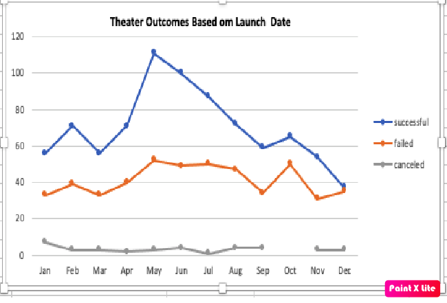
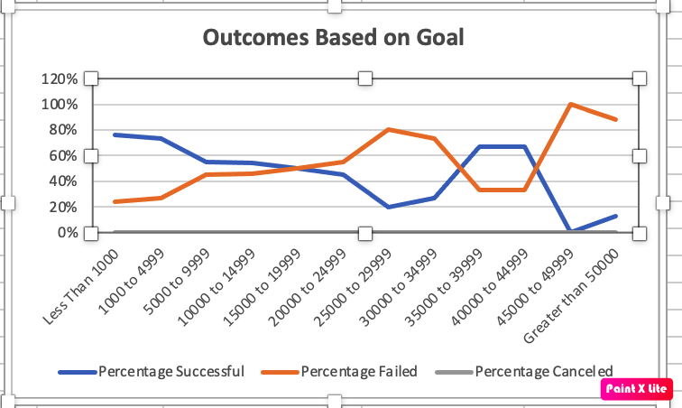

# Module-1-Challenge
Deliverable 1: Outcomes Based on Launch Date Chart 
Deliverable 2: Outcomes Based on Goals Chart 
Deliverable 3: A written analysis of the results (README.md)
# Kickstarting with Excel

## Overview of Project
The project overview is to help a beginning playwrite, Louise, determine how to create a crowdsourcing campaign to fund her new play, Fever.  She has estimated a budget and she has turned to us, Excel Master users to help her set up the best campaign for her play.

### Purpose
The purpose of our work is to provide data analytics that will support her budget.

## Analysis and Challenges
The analyses performed were as follows.  For Deliverable 1, I analyzed the relationship between outcomes and launch month by creating a pivot table from the Kickstarter Worksheet "Parent Category" and "Years" data.  The outcomes were specifically canceled, failed and successful. "Years" were filtered into months to give the visual representation of a line chart that showed which months were best to launch comparable plays; or plays that Louise liked.  For Deliverable 2, I visualized the data to best represent, successful, failed and canceled plays based on the funding amounts. I created a line chart that clearly showed the percentage successful and failed related to the goal-range amounts.  The canceled percentage was not represented in the chart.

### Analysis of Outcomes Based on Launch Date
 

### Analysis of Outcomes Based on Goals

### Challenges and Difficulties Encountered
My challenges and difficulties came from a place of truly having no expertise in Excel, as well as having Mac and Windows operating systems on the same computer.  They do not automaticiacally sync, so that has taken most of my time.  Having to learn work arounds to be able to accomplish tasks that others may find less challenging, has made me tired.  To assist me in my challenges, I employed my classmates.  On the first night of class, I created a Google Doc for us all to list our availability to work outside of class.  This has proved most useful, as I have set up three Zooms over the past three days to process the Deliverables outside of the TA hours.  Working with Terminal is something that I need to work on with assistance and patience, so that I can learn the commands and application to GitHub.

## Results

- What are two conclusions you can draw about the Outcomes based on Launch Date?

- What can you conclude about the Outcomes based on Goals?

- What are some limitations of this dataset?

- What are some other possible tables and/or graphs that we could create?

